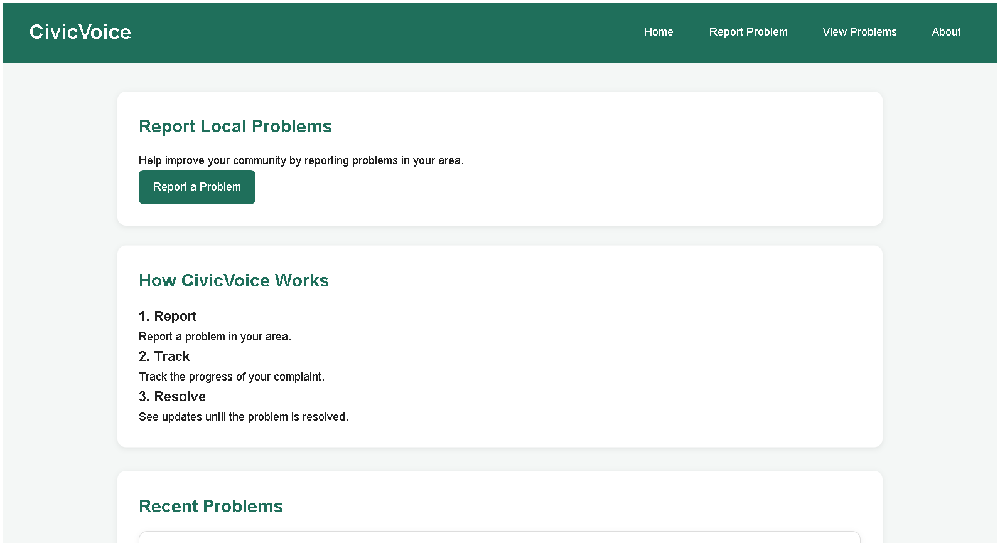
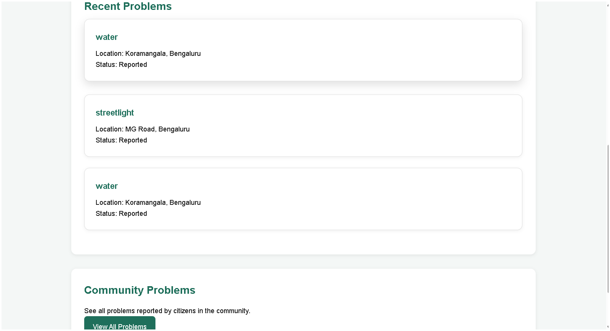
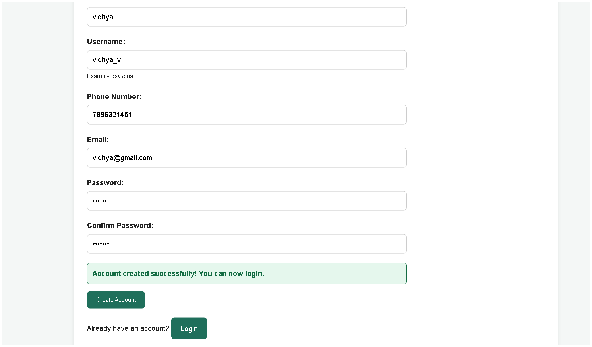
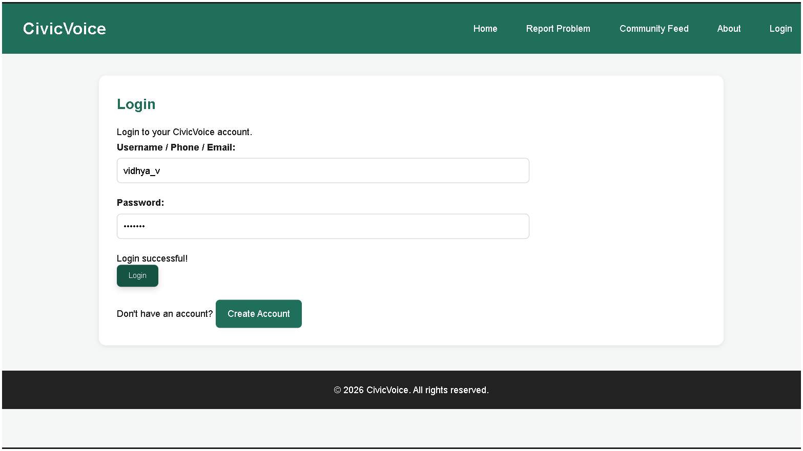
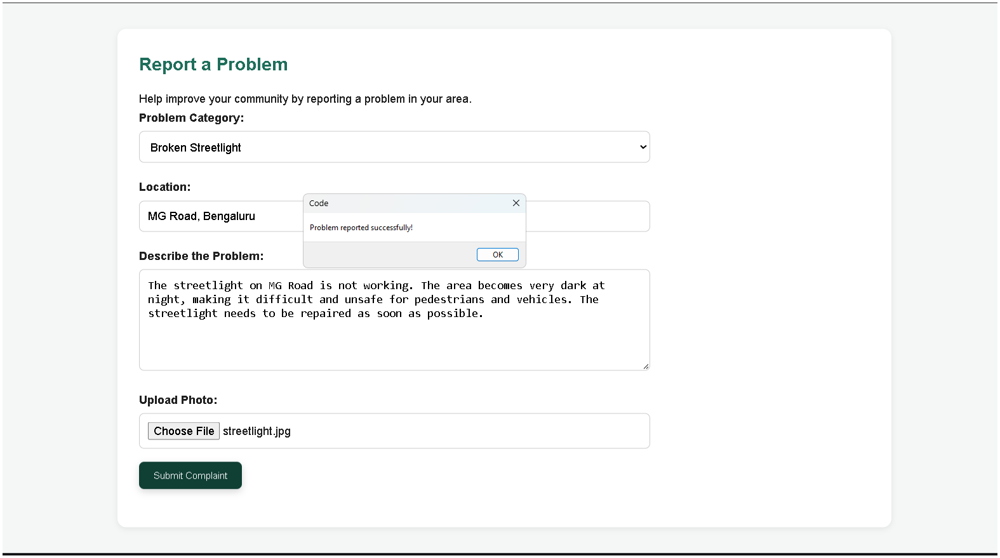
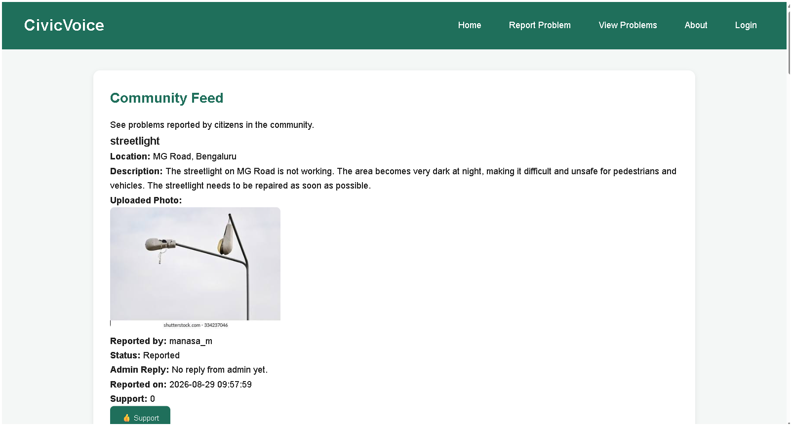
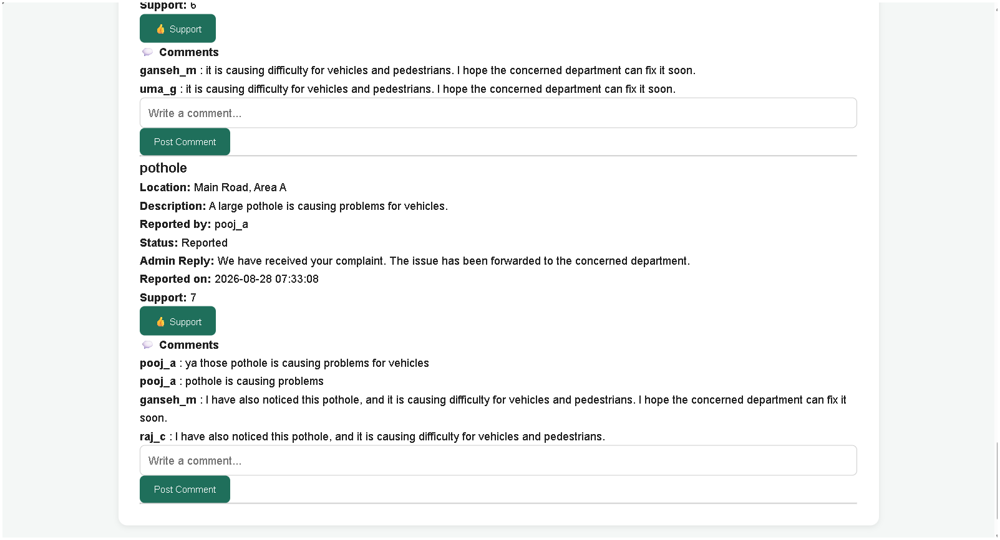
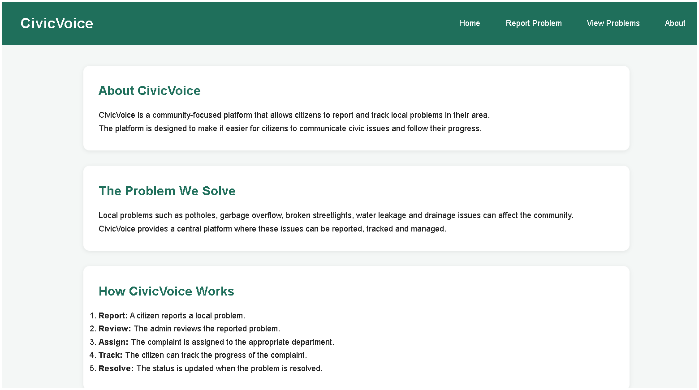
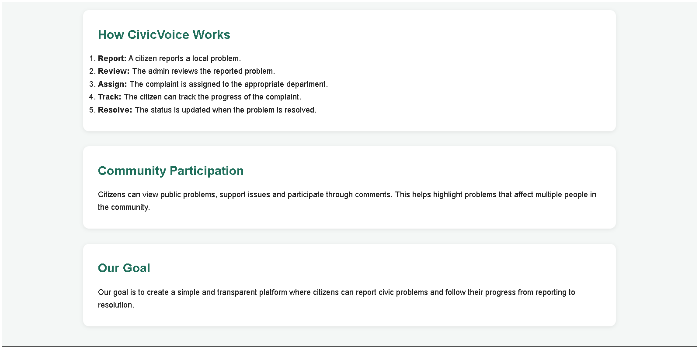

# CivicVoice

## Community Problem Reporting Web Application

CivicVoice is a web-based community problem reporting application that allows citizens to report problems in their area and interact with other community members.

Users can create an account, log in, report civic problems, upload photos, support reported problems, and post comments.

---

## Features

- User Registration
- User Login
- Report Community Problems
- Upload Problem Photos
- View Community Problems
- Support Reported Problems
- Comment on Problems
- Admin Panel
- Admin Replies and Problem Status
- SQLite Database Integration

---

## Technologies Used

### Frontend

- HTML
- CSS
- JavaScript

### Backend

- Python
- Flask

### Database

- SQLite

---

## Project Structure

```text
civicvoices/

├── backend/
│   ├── uploads/
│   ├── app.py
│   └── civicvoice.db
│
├── css/
│   └── style.css
│
├── image/
│
├── js/
│   ├── admin.js
│   ├── login.js
│   └── script.js
│
├── screenshots/
│   ├── about.png
│   ├── about2.png
│   ├── community-feed.png
│   ├── community-feed2.png
│   ├── home.png
│   ├── home2.png
│   ├── login.png
│   ├── registration.png
│   └── report-problem.png
│
├── .gitignore
├── about.html
├── admin.html
├── index.html
├── login.html
├── problems.html
├── register.html
├── report.html
└── README.md
```

---

## Screenshots

### Home Page



### Home Page – Recent Problems



### Registration Page



### Login Page



### Report a Problem



### Community Feed



### Community Feed – Support and Comments



### About Page



### About Page – Additional Section

